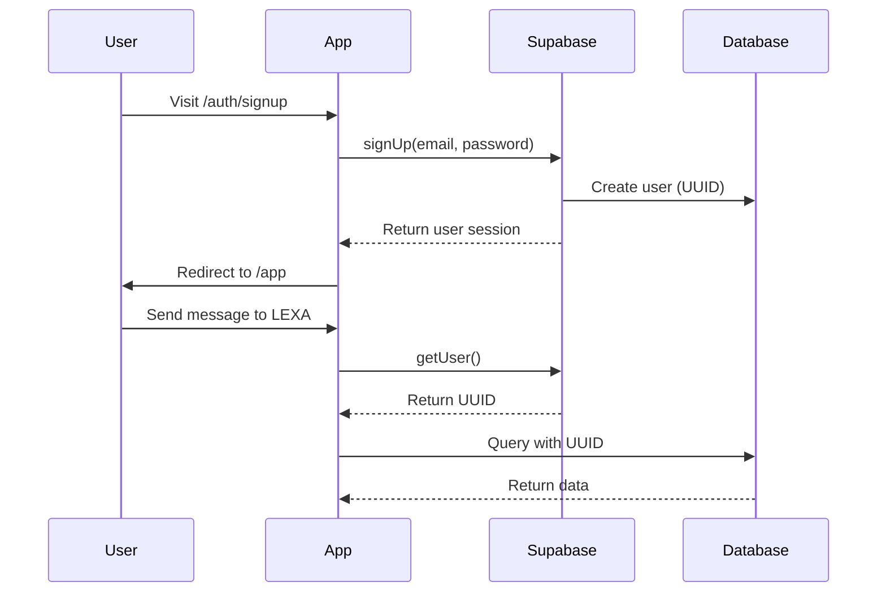

# ✅ Migration to Supabase Auth - COMPLETE!

LEXA has been successfully migrated from Clerk to Supabase Auth with native UUID support.

---

## What Changed

### 🔴 Removed
- ❌ `@clerk/nextjs` package
- ❌ Clerk middleware
- ❌ ClerkProvider
- ❌ Clerk environment variables
- ❌ All Clerk imports and components

### 🟢 Added
- ✅ `@supabase/ssr` for Supabase Auth
- ✅ Supabase Auth middleware
- ✅ Supabase client helpers (server & browser)
- ✅ Sign In page (`/auth/signin`)
- ✅ Sign Up page (`/auth/signup`)
- ✅ Auth callback route
- ✅ Sign out functionality

### 🔵 Updated
- ✅ All API routes now use Supabase Auth
- ✅ Chat page uses Supabase client
- ✅ Landing page checks Supabase auth status
- ✅ Middleware protects routes with Supabase
- ✅ Environment variables documentation
- ✅ Vercel configuration

---

## Files Modified (20 files)

### Core Auth Files
- `middleware.ts` - Supabase Auth middleware
- `lib/supabase/server.ts` - NEW: Server-side client
- `lib/supabase/client-browser.ts` - NEW: Browser client
- `lib/supabase/client.ts` - Updated admin client

### Pages
- `app/layout.tsx` - Removed ClerkProvider
- `app/page.tsx` - Using Supabase auth check
- `app/app/page.tsx` - Updated with sign out
- `app/auth/signin/page.tsx` - NEW
- `app/auth/signup/page.tsx` - NEW
- `app/auth/callback/route.ts` - NEW

### API Routes (all updated)
- `app/api/lexa/chat/route.ts`
- `app/api/lexa/preferences/route.ts`
- `app/api/lexa/session/[id]/route.ts`
- `app/api/lexa/brief/[sessionId]/route.ts`

### Documentation
- `README.md` - Updated setup instructions
- `vercel.json` - Updated env vars

---

## Next Steps

### 1. Update Environment Variables

Edit `.env.local` and update/add these:

```env
# Remove these (Clerk):
# NEXT_PUBLIC_CLERK_PUBLISHABLE_KEY=
# CLERK_SECRET_KEY=

# Add/Update these (Supabase):
NEXT_PUBLIC_SUPABASE_URL=https://your-project.supabase.co
NEXT_PUBLIC_SUPABASE_ANON_KEY=your-anon-key-here
SUPABASE_SERVICE_ROLE_KEY=your-service-role-key

# Keep this:
ANTHROPIC_API_KEY=sk-ant-...
```

### 2. Get Supabase Keys

1. Go to your Supabase project dashboard
2. Navigate to Settings → API
3. Copy these three keys:
   - **Project URL** → `NEXT_PUBLIC_SUPABASE_URL`
   - **anon/public** → `NEXT_PUBLIC_SUPABASE_ANON_KEY`
   - **service_role** → `SUPABASE_SERVICE_ROLE_KEY`

### 3. Configure Supabase Auth

In Supabase Dashboard:
1. Go to Authentication → URL Configuration
2. Add redirect URL: `http://localhost:3000/auth/callback`
3. For production, add: `https://your-domain.com/auth/callback`

### 4. Test the Migration

```bash
# Start the dev server
npm run dev

# Test flow:
1. Go to http://localhost:3000
2. Click "Start Your Experience"
3. Sign up with email/password
4. You should be redirected to /app
5. Test the chat interface
6. Click "Sign Out"
```

---

## Database Compatibility

✅ **UUID user_id** - Now fully compatible!

The database uses UUID for `user_id` columns:
```sql
user_id UUID -- Supabase Auth provides UUID natively
```

Supabase Auth provides:
```typescript
const { data: { user } } = await supabase.auth.getUser();
const userId = user.id; // UUID! ✅
```

Perfect match - no conversion needed!

---

## Authentication Flow



---

## Features

### ✅ What Works Now

- **Email/Password Auth** - Sign up and sign in
- **Session Management** - Automatic token refresh
- **Protected Routes** - Middleware guards /app routes
- **Sign Out** - Clean session termination
- **UUID Integration** - Native support, no conversion needed
- **RLS Ready** - Database policies work with `auth.uid()`

### 🚧 Can Be Added Later

- **Magic Links** - Passwordless authentication
- **Social Logins** - Google, GitHub, etc.
- **Password Reset** - Email-based recovery
- **Email Verification** - Confirm email addresses
- **Multi-Factor Auth** - Extra security layer

---

## Benefits of Supabase Auth

1. ✅ **Native UUID** - Matches database perfectly
2. ✅ **Simpler Stack** - One less service to manage
3. ✅ **Better Integration** - RLS policies work natively
4. ✅ **Lower Costs** - No Clerk subscription needed
5. ✅ **Full Control** - All auth data in your Supabase project
6. ✅ **Production Ready** - Battle-tested at scale

---

## Troubleshooting

### "Unauthorized" errors
- Check that `.env.local` has all three Supabase keys
- Restart dev server after adding keys: `npm run dev`

### Can't sign up
- Check Supabase Auth is enabled in dashboard
- Verify redirect URL is configured
- Check browser console for errors

### Session not persisting
- Clear browser cookies
- Check middleware is running (should see it in terminal)
- Verify `NEXT_PUBLIC_SUPABASE_ANON_KEY` is set

---

## Success Checklist

- [ ] Updated `.env.local` with Supabase keys
- [ ] Configured redirect URLs in Supabase
- [ ] Ran `npm install` (already done)
- [ ] Started dev server with `npm run dev`
- [ ] Tested sign up flow
- [ ] Tested sign in flow
- [ ] Tested protected /app route
- [ ] Tested sign out
- [ ] Sent a message to LEXA in chat

---

**Migration Status:** ✅ COMPLETE

**Next:** Add your Supabase keys and start the server!

```bash
npm run dev
```

Then visit http://localhost:3000 and sign up! 🚀

